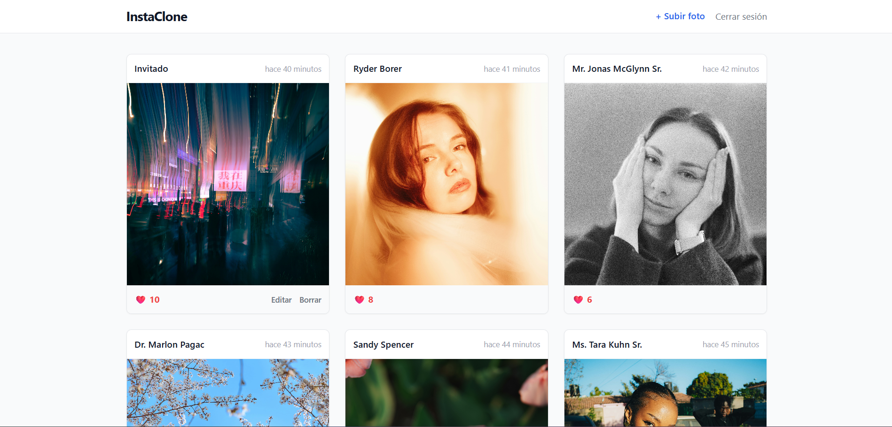
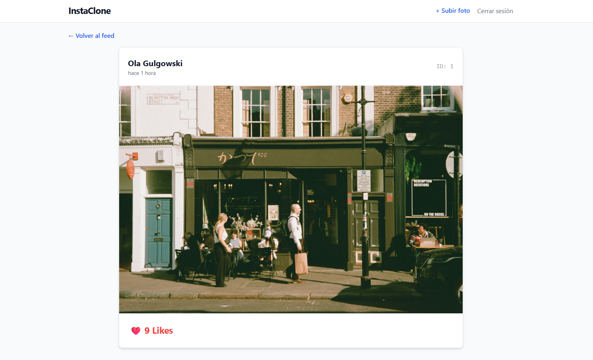
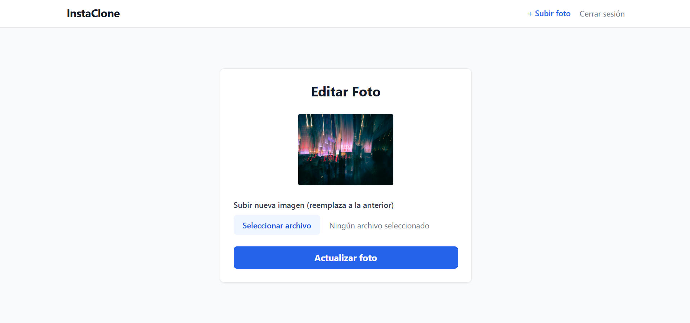
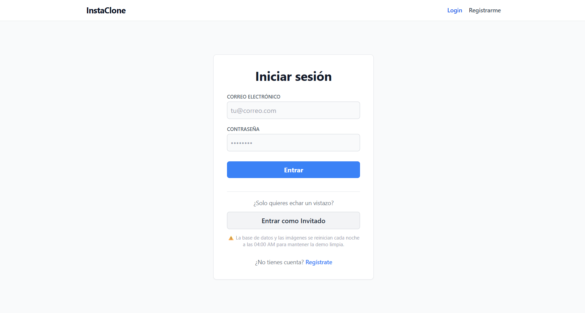
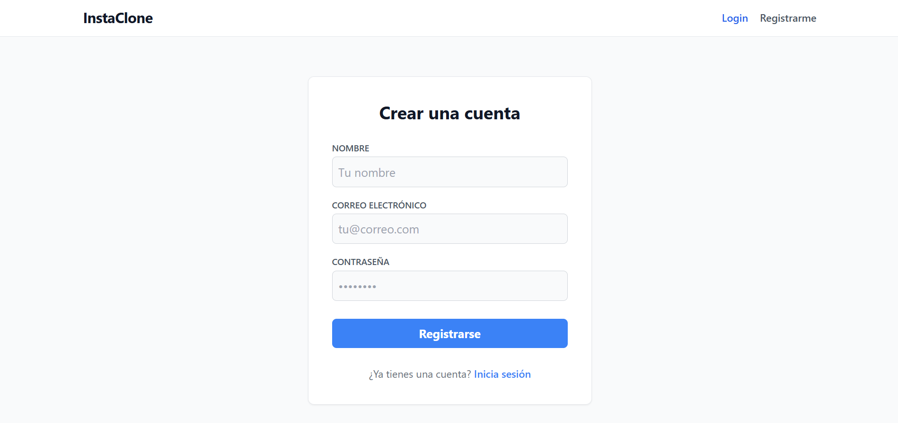

# 📸 Laravel InstaClone

Un clon minimalista y funcional de una red social de fotografías. Este proyecto ha sido desarrollado con el objetivo principal de poner en práctica y dominar características clave del backend con Laravel, enfocándose en la arquitectura de datos y la seguridad.

## Capturas del Proyecto

  
  
<em>Feed fotográfico principal</em>

  
  
<em>Vista de detalle e interacción en tiempo real</em>

  
  
<em>Panel de edición de una publicación</em>

  
  
  
<em>Pantallas seguras de acceso y registro de usuarios</em>

## Enfoque Técnico del Proyecto

* **Relaciones de modelos con Eloquent:** Implementación de relaciones `HasMany` / `BelongsTo` (Usuarios y Fotos) y relaciones complejas `BelongsToMany` (Sistema de "Likes" entre Usuarios y Fotos).
* **Gestión de Archivos Multimedia:** Uso de la facade `Storage` de Laravel para la subida, validación, almacenamiento seguro y enlace público (`storage:link`) de imágenes.
* **Sistema de Autenticación:** Gestión de sesiones, registro y login seguro de usuarios utilizando las herramientas nativas de autenticación de Laravel.

## Características de la Interfaz
* **Feed fotográfico:** Visualización ágil de publicaciones.
* **Interacciones:** Capacidad de dar y quitar "Likes" a las publicaciones en tiempo real.
* **Experiencia de Usuario (UX):** Interfaz responsive construida con Tailwind CSS, incluyendo "Skeleton loaders" nativos (JavaScript + Tailwind) para evitar saltos visuales durante la carga de imágenes.

## Stack Tecnológico
* **Framework:** Laravel 11 (PHP)
* **Base de datos:** MySQL
* **Frontend:** Blade Templates y Tailwind CSS
* **Despliegue:** Servidor propio (Plesk) con despliegue continuo vía GitHub.
